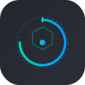

<div align="center" style="border-bottom: none">
    
    <h1>Clearminutes</h1>
    <p><strong>Privacy-First AI Meeting Assistant</strong></p>
    <br>
    <a href="https://github.com/jgibbarduk/clearminutes/releases/"></a>
    <a href="https://github.com/jgibbarduk/clearminutes/releases"></a>
    <a href="https://github.com/jgibbarduk/clearminutes/releases"></a>
    <a href="https://github.com/jgibbarduk/clearminutes/releases"></a>
    <a href="https://github.com/jgibbarduk/clearminutes/releases"></a>
    <a href="https://github.com/jgibbarduk/clearminutes/releases"></a>
    <br>
    <h3>
    <br>
    Open Source • Privacy-First • Enterprise-Ready
    </h3>
    <p align="center">
    <a href="https://clearminutes.app"><b>Website</b></a>
</p>
    <p align="center">

A privacy-first AI meeting assistant that captures, transcribes, and summarises meetings entirely on your infrastructure. Built for professionals and enterprises who need complete data sovereignty without sacrificing capability.

</p>

<p align="center">
    
    <br>
    <a href="https://youtu.be/6FnhSC_eSz8">View full Demo Video</a>
</p>

</div>

---

<details>
<summary>Table of Contents</summary>

- [Introduction](#introduction)
- [Why Clearminutes?](#why-clearminutes)
- [Features](#features)
- [Installation](#installation)
- [Key Features in Action](#key-features-in-action)
- [System Architecture](#system-architecture)
- [For Developers](#for-developers)
- [Contributing](#contributing)
- [License](#license)

</details>

## Introduction

Clearminutes is a privacy-first AI meeting assistant that runs entirely on your local machine. It captures your meetings, transcribes them in real-time, and generates summaries — all without sending any data to the cloud. The perfect solution for professionals and enterprises who need to maintain complete control over their sensitive information.

## Why Clearminutes?

While there are many meeting transcription tools available, Clearminutes stands out by offering:

- **Privacy First:** All processing happens locally on your device.
- **Cost-Effective:** Uses open-source AI models instead of expensive APIs.
- **Flexible:** Works offline and supports multiple meeting platforms.
- **Customisable:** Self-host and modify for your specific needs.

<details>
<summary>The Privacy Problem</summary>

Meeting AI tools create significant privacy and compliance risks across all sectors:

- **$4.4M average cost per data breach** (IBM 2024)
- **€5.88 billion in GDPR fines** issued by 2025
- **400+ unlawful recording cases** filed in California this year

Whether you're a defence consultant, enterprise executive, legal professional, or healthcare provider, your sensitive discussions shouldn't live on servers you don't control. Cloud meeting tools promise convenience but deliver privacy nightmares with unclear data storage practices and potential unauthorised access.

**Clearminutes solves this:** Complete data sovereignty on your infrastructure, zero vendor lock-in, and full control over your sensitive conversations.

</details>

## Features

- **Local First:** All processing is done on your machine. No data ever leaves your computer.
- **Real-time Transcription:** Get a live transcript of your meeting as it happens.
- **AI-Powered Summaries:** Generate summaries of your meetings using powerful language models.
- **Multi-Platform:** Works on macOS, Windows, and Linux.
- **Open Source:** Clearminutes is open source and free to use.
- **Flexible AI Provider Support:** Choose from Ollama (local), Claude, Groq, OpenRouter, or use your own OpenAI-compatible endpoint.

## Installation

### 🪟 **Windows**

1. Download the latest `x64-setup.exe` from [Releases](https://github.com/jgibbarduk/clearminutes/releases/latest)
2. Run the installer

### 🍎 **macOS**

1. Download `clearminutes_1.0.0_aarch64.dmg` from [Releases](https://github.com/jgibbarduk/clearminutes/releases/latest)
2. Open the downloaded `.dmg` file
3. Drag **Clearminutes** to your Applications folder
4. Open **Clearminutes** from Applications folder

### 🐧 **Linux**

Build from source following our detailed guides:

- [Building on Linux](docs/building_in_linux.md)
- [General Build Instructions](docs/BUILDING.md)

**Quick start:**

```bash
git clone https://github.com/jgibbarduk/clearminutes
cd clearminutes/frontend
pnpm install
./build-gpu.sh
```

## Key Features in Action

### 🎯 Local Transcription

Transcribe meetings entirely on your device using **Whisper** or **Parakeet** models. No cloud required.

<p align="center">
    
</p>

### 📥 Import & Enhance `Beta`

Import existing audio files to generate transcripts, or enhance to re-transcribe any recorded meeting with a different model or language, all processed locally.

> Contributed by [Jeremi Joslin](https://github.com/jeremi), improved by [Vishnu P S](https://github.com/p-s-vishnu) and [Mohammed Safvan](https://github.com/mohammedsafvan)

<p align="center">
    
</p>

### 🤖 AI-Powered Summaries

Generate meeting summaries with your choice of AI provider. **Ollama** (local) is recommended, with support for Claude, Groq, OpenRouter, and OpenAI.

<p align="center">
    
</p>

<p align="center">
    
</p>

### 🔒 Privacy-First Design

All data stays on your machine. Transcription models, recordings, and transcripts are stored locally.

<p align="center">
    
</p>

### 🌐 Custom OpenAI Endpoint Support

Use your own OpenAI-compatible endpoint for AI summaries. Perfect for organisations with custom AI infrastructure or preferred providers.

<p align="center">
    
</p>

### 🎙️ Professional Audio Mixing

Capture microphone and system audio simultaneously with intelligent ducking and clipping prevention.

<p align="center">
    
</p>

### ⚡ GPU Acceleration

Built-in support for hardware acceleration across platforms:

- **macOS**: Apple Silicon (Metal) + CoreML
- **Windows/Linux**: NVIDIA (CUDA), AMD/Intel (Vulkan)

Automatically enabled at build time — no configuration needed.

## System Architecture

Clearminutes is a single, self-contained application built with [Tauri](https://tauri.app/). It uses a Rust-based backend to handle all the core logic, and a Next.js frontend for the user interface.

For more details, see the [Architecture documentation](docs/architecture.md).

## For Developers

If you want to contribute to Clearminutes or build it from source, you'll need to have Rust and Node.js installed. For detailed build instructions, please see the [Building from Source guide](docs/BUILDING.md).

## Contributing

We welcome contributions from the community! If you have any questions or suggestions, please open an issue or submit a pull request. Please follow the established project structure and guidelines. For more details, refer to the [CONTRIBUTING.md](CONTRIBUTING.md) file.

Thanks for all the contributions. Our community is what makes this project possible.

## License

MIT License - Feel free to use this project for your own purposes.

## Acknowledgments

