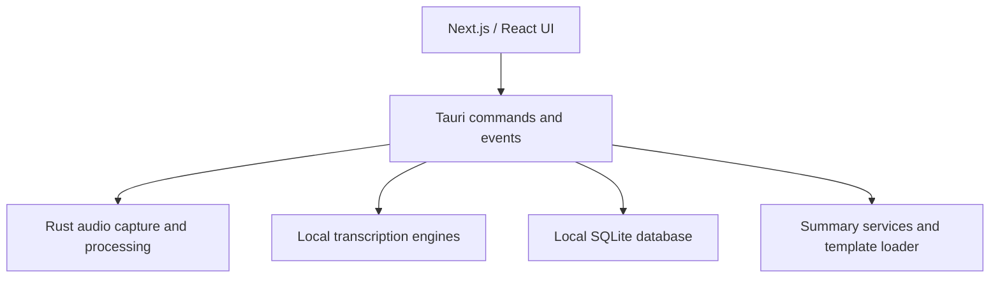

# Architecture

Meetily is a self-contained desktop application built with Tauri.

## High-Level Structure

## Frontend

The frontend lives in [`frontend/src/`](../frontend/src/).

It is responsible for:

- Recording controls
- Meeting and transcript views
- Summary and template selection
- Settings and model configuration
- Analytics consent UI

Frontend code talks to the native layer through Tauri `invoke` commands and event listeners.

## Native Layer

The Rust application lives in [`frontend/src-tauri/`](../frontend/src-tauri/).

Key areas:

- [`src/lib.rs`](../frontend/src-tauri/src/lib.rs): command registration and app setup
- [`src/audio/`](../frontend/src-tauri/src/audio/): device handling, capture, mixing, VAD, recording, import, and retranscription
- [`src/database/`](../frontend/src-tauri/src/database/): SQLite initialization, migrations, and repositories
- [`src/summary/`](../frontend/src-tauri/src/summary/): summary generation, provider integration, and templates
- [`src/whisper_engine/`](../frontend/src-tauri/src/whisper_engine/) and [`src/parakeet_engine/`](../frontend/src-tauri/src/parakeet_engine/): local transcription engines

## Data Flow

### Recording and Transcription

1. The UI starts a recording through a Tauri command.
2. Rust audio code captures microphone and system audio.
3. The pipeline applies buffering, normalization, and VAD segmentation.
4. Speech segments are sent to the selected local transcription engine.
5. Transcript updates are emitted back to the frontend.

### Storage

The native app stores:

- meetings
- transcript segments
- summary state
- settings
- notes

in a local SQLite database managed by the Tauri layer.

### Summaries

Summary generation is initiated from the desktop app and uses:

- local providers: Ollama, BuiltInAI
- optional external providers: OpenAI, Claude, Groq, OpenRouter, custom OpenAI-compatible endpoints

Templates are loaded from built-in definitions, bundled files, and user template files in the app data directory.

## Removed Legacy Path

This repository no longer treats the old FastAPI backend as part of the active product architecture.
