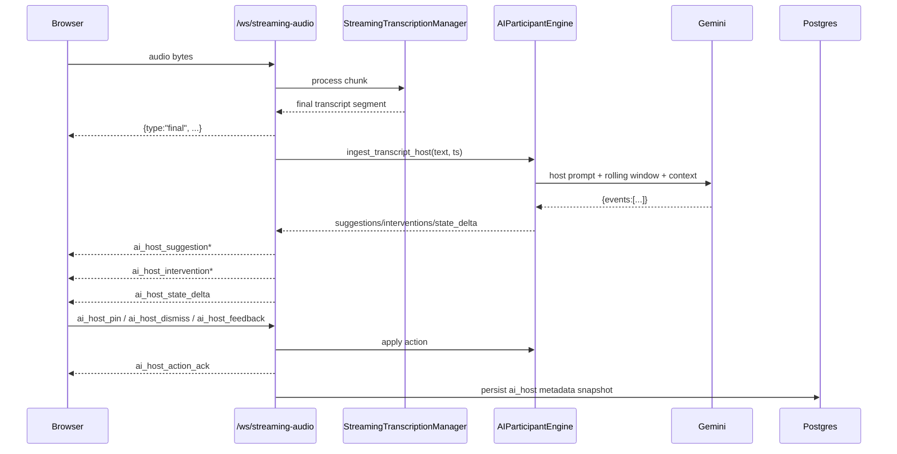

# AI Host v1 Implementation Guide

## 1. Purpose

This document describes the AI Host v1 implementation that upgraded the previous guardrail-only participant into an active, policy-driven meeting participant.

It covers:
- What was implemented
- Why it was implemented this way
- End-to-end architecture
- Data contracts (WebSocket + REST)
- Runtime behavior and state transitions
- Persistence model (including per-user skill profiles)
- RBAC and safety boundaries
- Validation, rollout guidance, and troubleshooting

---

## 2. What Was Implemented

### 2.1 Backend AI engine pivot

The AI participant was extended from a single guardrail evaluator to an active host pipeline in `backend/app/services/ai_participant.py`.

New capabilities:
- Host event detection (`ingest_transcript_host`)
- Policy-based suggestion gating
- Policy-based intervention gating
- Runtime meeting host state tracking
- Human confirmation flows (pin/dismiss/feedback)
- Skill/template-driven host behavior

### 2.2 New host schema contracts

In `backend/app/schemas/ai_participant.py`, new schema types were added:
- `HostEventType`
- `HostSuggestion`
- `HostInterventionCard`
- `MeetingHostState`
- `HostPolicyConfig`
- `HostRoleMode`

### 2.3 WebSocket protocol extension

In `backend/app/api/routers/audio.py` and frontend websocket client:

New outbound events:
- `ai_host_suggestion`
- `ai_host_intervention`
- `ai_host_state_delta`

New inbound actions:
- `host_skill_override`
- `ai_host_pin`
- `ai_host_dismiss`
- `ai_host_feedback`

Compatibility retained:
- Legacy `ai_guardrail_alert` is still emitted for existing clients.

### 2.4 Frontend live host panel

In `frontend/src/app/page.tsx` and related streaming wiring:
- Added AI Host panel
- Shows active intervention
- Shows suggestion queue
- Supports Pin/Dismiss actions
- Keeps legacy guardrail fallback visible

### 2.5 Per-user persisted skill profiles

Implemented persistent user skill profiles in DB + settings API.

Migration:
- `backend/app/migrations/014_user_ai_host_skills.sql`

DB methods (`backend/app/db/manager.py`):
- `upsert_user_ai_host_skill`
- `get_user_ai_host_skill`
- `delete_user_ai_host_skill`

Settings API (`backend/app/api/routers/settings.py`):
- `GET /api/user/ai-host-skill`
- `POST /api/user/ai-host-skill`
- `DELETE /api/user/ai-host-skill`

Audio session startup now loads user skill profile and applies it as host policy source `user` when available.

### 2.6 Persisted meeting-level skill profiles

Implemented meeting-level persisted skill profiles in DB + meetings API.

Migration:
- `backend/app/migrations/015_meeting_ai_host_skills.sql`

DB methods (`backend/app/db/manager.py`):
- `upsert_meeting_ai_host_skill`
- `get_meeting_ai_host_skill`
- `delete_meeting_ai_host_skill`

Meetings API (`backend/app/api/routers/meetings.py`):
- `GET /meeting-ai-host-skill/{meeting_id}`
- `POST /meeting-ai-host-skill`
- `DELETE /meeting-ai-host-skill/{meeting_id}`

Audio session startup now applies persisted policy in this order:
1. Meeting profile
2. User profile
3. System template

### 2.7 Style library + default style + start-time selector

Implemented a style-library model for AI Host behavior:
- System styles are read-only (`facilitator`, `advisor`, `chairperson`)
- Users can create/edit/delete custom styles
- User can set one default style
- Start screen now lets user choose AI Host style for current meeting session
  - `Use default style` option available as one-click top choice
  - Custom styles appear in dropdown automatically

---

## 3. Architecture Overview

## 3.1 High-level flow



## 3.2 Two-stage host reasoning model

Stage 1: **Candidate extraction**
- LLM identifies candidate events from rolling transcript window:
  - `decision_candidate`
  - `conflict_risk`
  - `agenda_drift`
  - `urgency_risk`
  - `mistake_candidate`
  - `unheard_participant`
  - `open_question`

Stage 2: **Policy arbitration**
- Applies thresholds and controls from `HostPolicyConfig`:
  - confidence threshold per event
  - dedupe signature checks
  - cooldowns
  - role-mode intervention policy (`advisor`, `facilitator`, `chairperson`)

Output:
- Suggestion (candidate) may be emitted
- Intervention card may be emitted if policy allows
- Host state always advances

---

## 4. Skill and Policy Architecture

## 4.1 Skill sources and precedence

Current effective precedence:
1. In-session meeting override (`host_skill_override` over websocket)
2. Persisted meeting profile (`meeting_ai_host_skills` table)
3. User default style selection (`user_ai_host_style_defaults`)
4. Persisted per-user legacy profile (`user_ai_host_skills` table, compatibility fallback)
5. System default template (fallback) from built-in templates

Built-in templates in service:
- `facilitator`
- `advisor`
- `chairperson`

## 4.2 Skill syntax

v1 parser supports both:
- Human-readable markdown skill files (`Role & Identity`, `Behavior Rules`, etc.)
- Explicit policy config lines (`key: value`) for deterministic control

Example:
```text
role_mode: advisor
min_confidence: 0.82
suggestion_cooldown_seconds: 90
intervention_cooldown_seconds: 180
threshold_conflict_risk: 0.90
forbidden_actions: shame_participants, legal_advice
```

Parsed fields:
- Role and confidence controls
- Cooldowns and state limits
- Event-specific thresholds (`threshold_<event_type>`)
- Boolean toggles (e.g., `allow_interruptions`)
- Forbidden action list

Parser behavior:
- If markdown includes a fenced config block (yaml/yml/txt), that block is parsed first.
- If only natural-language markdown is provided, heuristic role/policy inference is applied (e.g., “Tech Lead” maps to chairperson-style behavior).
- Explicit `key: value` values take precedence over inferred values.

---

## 5. Runtime State Model

`MeetingHostState` tracks:
- `agenda_progress`
- `current_topic`
- `unresolved_items`
- `suggested_items`
- `pinned_items`
- `dismissed_item_ids`
- `intervention_history`
- `last_response_outcomes`
- `counters`
- `updated_at`

Human confirmation semantics:
- Suggestions are provisional
- `pin` promotes suggestion to confirmed state
- `dismiss` records rejection and removes from pending list
- `feedback` records response signal in outcomes

---

## 6. WebSocket Contracts

## 6.1 Outbound: `ai_host_suggestion`

Example:
```json
{
  "type": "ai_host_suggestion",
  "id": "uuid",
  "event_type": "urgency_risk",
  "title": "Decision needed",
  "content": "Time is running out without a clear decision.",
  "confidence": 0.92,
  "timestamp": "2026-03-10T12:00:00.000Z",
  "status": "suggested",
  "source_excerpt": "...",
  "metadata": {"priority": "high"}
}
```

## 6.2 Outbound: `ai_host_intervention`

Example:
```json
{
  "type": "ai_host_intervention",
  "id": "uuid",
  "event_type": "urgency_risk",
  "headline": "Decision needed",
  "body": "Time is running out without a clear decision.",
  "priority": "high",
  "confidence": 0.92,
  "timestamp": "2026-03-10T12:00:00.000Z",
  "linked_suggestion_id": "uuid"
}
```

## 6.3 Outbound: `ai_host_state_delta`

Example:
```json
{
  "type": "ai_host_state_delta",
  "state": {"meeting_id": "...", "suggested_items": [], "pinned_items": []},
  "timestamp": "2026-03-10T12:00:00.000Z"
}
```

## 6.4 Inbound actions

Pin:
```json
{"type": "ai_host_pin", "suggestion_id": "uuid"}
```

Dismiss:
```json
{"type": "ai_host_dismiss", "suggestion_id": "uuid"}
```

Feedback:
```json
{"type": "ai_host_feedback", "suggestion_id": "uuid", "feedback": "too_aggressive"}
```

Skill override (meeting runtime):
```json
{"type": "host_skill_override", "skill_markdown": "role_mode: facilitator\n..."}
```

Acknowledgements:
- `ai_host_action_ack`
- `host_skill_ack`

---

## 7. REST API for User Skill Profiles

Base router: `backend/app/api/routers/settings.py`

- `GET /api/user/ai-host-skill`
  - Fetch persisted user profile (or empty default payload)
- `POST /api/user/ai-host-skill`
  - Save/update user profile
  - max markdown length currently enforced at 20000 chars
- `DELETE /api/user/ai-host-skill`
  - Remove persisted user profile

Style library APIs:
- `GET /api/user/ai-host-styles`
  - List system read-only styles + user custom styles + default marker
- `POST /api/user/ai-host-styles`
  - Create custom style
- `PUT /api/user/ai-host-styles/{style_id}`
  - Update custom style
- `DELETE /api/user/ai-host-styles/{style_id}`
  - Delete custom style
- `POST /api/user/ai-host-styles/default`
  - Set user default style (`system:*` or `user:*`)

Auth model:
- Uses existing `get_current_user` dependency
- Profile scope is per authenticated user email

---

## 8. Persistence and Observability

## 8.1 New table

`user_ai_host_skills`
- `user_email` (PK)
- `skill_markdown`
- `is_active`
- `created_at`
- `updated_at`

`meeting_ai_host_skills`
- `meeting_id` (PK)
- `skill_markdown`
- `is_active`
- `updated_by`
- `created_at`
- `updated_at`

`user_ai_host_styles`
- `id` (PK)
- `user_email`
- `name`
- `skill_markdown`
- `is_active`
- `created_at`
- `updated_at`

`user_ai_host_style_defaults`
- `user_email` (PK)
- `default_style_id`
- `updated_at`

## 8.2 Session metadata patches

Streaming metadata now includes host-specific snapshots/counters such as:
- `ai_host`
- `ai_host_state`
- `ai_host_last_suggestion`
- `ai_host_last_intervention`
- `ai_host_pinned_items`
- `ai_host_policy_source`

Compatibility metadata retained:
- guardrail fields are still updated where needed

---

## 9. RBAC and Safety

For host-confirmation actions (`pin`, `dismiss`, `feedback`, meeting skill override):
- Backend enforces edit-capability checks in websocket flow before applying action
- Unauthorized clients receive `applied: false` in action acknowledgements

Safety behavior in policy engine:
- Confidence gate
- Per-event cooldown gate
- Duplicate signature suppression
- Role-mode scope constraints (advisor is narrower than facilitator/chairperson)

---

## 10. Frontend Functional Changes

Files:
- `frontend/src/lib/audio-streaming/AudioStreamClient.ts`
- `frontend/src/components/RecordingControls.tsx`
- `frontend/src/app/page.tsx`
- `frontend/src/components/AIHostSkillSettings.tsx`
- `frontend/src/app/settings/page.tsx`
- `frontend/src/components/MeetingDetails/MeetingAIHostSkillDialog.tsx`
- `frontend/src/components/MeetingDetails/SummaryPanel.tsx`

Capabilities:
- Handles new host websocket event types
- Exposes action methods from stream client:
  - `pinHostSuggestion`
  - `dismissHostSuggestion`
  - `sendHostFeedback`
  - `applyHostSkillOverride`
- Renders AI Host panel with:
  - active intervention card
  - suggestion queue
  - pin/dismiss controls
  - legacy guardrail fallback note
- Adds Settings UI for persisted user AI host profile:
  - load/save/delete profile
  - apply facilitator/advisor/chairperson templates
  - toggle profile active/inactive
- Adds meeting-details UI for persisted meeting AI host profile:
  - bot icon in meeting details header opens dialog
  - load/save/delete meeting-level profile
  - apply facilitator/advisor/chairperson templates
  - toggle profile active/inactive

Stability fix included:
- Recording teardown regression from unstable callback identity was fixed by ensuring host-client lifecycle cleanup runs only on unmount and parent callback is stable.

---

## 11. How It Was Implemented (Execution Summary)

1. Added host schema contracts and policy models.
2. Refactored AI engine to support host event extraction + policy arbitration.
3. Extended websocket server with host event publishing and host action handling.
4. Preserved legacy guardrail output for backward compatibility.
5. Built frontend host panel and action wiring.
6. Added per-user skill persistence table + DB APIs + settings REST APIs.
7. Wired audio session startup to auto-load user skill profile.
8. Added unit tests for host engine behavior and parsing.
9. Validated type/syntax compilation paths.

---

## 12. Validation Checklist

## Backend
- Apply DB migration `014_user_ai_host_skills.sql`
- Confirm settings endpoints return 200 with auth
- Start streaming session and verify host events emitted
- Verify pin/dismiss actions mutate host state and metadata

## Frontend
- Verify transcript stream remains active
- Verify host intervention card updates live
- Verify suggestion queue pin/dismiss actions produce `ai_host_action_ack`

## Compatibility
- Existing UI path still receives `ai_guardrail_alert` fallback

---

## 13. Known Constraints and Next Iterations

Current constraints:
- Skill parser is intentionally lightweight (`key: value`) but now supports markdown bullet-style lines and fenced config blocks
- TTS is intentionally out of scope for this version

Recommended next steps:
- Add persistent meeting-level skill storage and admin policy templates
- Add richer skill DSL validation and linting
- Add explicit analytics dashboard charts for host quality metrics (pin rate, dismiss rate, intervention precision)
- Add end-to-end automated tests for websocket host flows

---

## 14. Ownership and Rollout Notes

Before production rollout:
- Confirm migration run on all environments
- Confirm per-user skill endpoint auth/permissions in staging
- Tune default thresholds per role mode from real meeting telemetry
- Run limited rollout to internal users first and monitor:
  - suggestion spam rate
  - intervention usefulness (pin/dismiss ratio)
  - websocket stability and reconnect behavior
