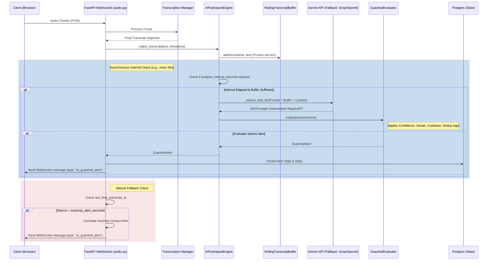

# AI Meeting Participant (Real-Time Meeting Intelligence)

## 1. Feature Overview

Pnyx features an in-meeting AI capability that acts as a silent participant monitoring live conversations for communication breakdowns or situations requiring intervention.

Unlike typical summary bots, this feature is implemented as a lightweight, real-time guardrail system that:
- Analyzes a rolling transcript window in real-time.
- Checks meeting context (title, description, optional user-defined agenda).
- Intervenes **only** when specific risk conditions are met (e.g., agenda deviation, prolonged indecision, unresolved questions).
- Emits structured JSON alerts down the websocket to be surfaced cleanly in the UI side panel.

## 2. System Architecture & Component Breakdown

The AI Participant system operates parallel to the live audio transcription pipeline. It is entirely non-blocking to the critical path of audio processing.

### A. The Components (`ai_participant.py`)

1. **`RollingTranscriptBuffer`**
   Maintains the recent utterance history. It is bounded by both time (e.g., last 180 seconds) and character count (e.g., max 6000 characters) to ensure the LLM prompt fits within context limits and only analyzes recent, relevant speech.
2. **`MeetingContext` & `AIParticipantEngine`**
   The core orchestrator. It packages the static/dynamic meeting context (Goal, Agenda, Participants) alongside the active buffer. It manages the analysis interval (e.g., every 90 seconds) to prevent spamming the LLM, handles LLM fallback chains (e.g., Gemini Pro -> Flash), and parses the structured JSON response.
3. **`GuardrailEvaluator`**
   The deterministic filter sitting *after* the LLM reasoning phase. It suppresses LLM outputs based on strict rules:
   - **Confidence Checks:** Rejects insights below a minimum confidence threshold (default 0.70).
   - **Sustained Streaks:** Requires "agenda deviation" to be sustained over multiple analysis cycles before alerting.
   - **Duration Thresholds:** Requires "no decision" or "unresolved question" to only trigger if the active discussion window is sufficiently long.
   - **Cooldowns & Deduping:** Prevents spamming the UI by enforcing a cooldown period (default 180s) and suppressing identical insights using a signature hash (`reason:normalized_insight`).

### B. The Integration (`audio.py`)

The fast-path websocket in `audio.py` pushes final transcript segments to the `AIParticipantEngine`. The engine runs its interval checks asynchronously. If an alert is generated, `audio.py` immediately beams an `ai_guardrail_alert` payload to the frontend.

Additionally, `audio.py` handles an **Inactivity Fallback Alert**. If absolute silence is detected for an extended period (e.g., 3 minutes) while the meeting is active, it bypasses the LLM and emits a hardcoded "missing context" alert to prompt the team to start the agenda.

---

## 3. Complete Data Flow Diagram



---

## 4. LLM Reasoning Model & Fallbacks

The AI Participant relies heavily on structured output generation. 

### Trigger Conditions (The `reason` Enum)
1. `agenda_deviation`: Conversation has drifted significantly from the registered agenda.
2. `no_decision`: Lengthy discussion on a topic without reaching a clear conclusion.
3. `unresolved_question`: An important question was asked but ignored or forgotten.
4. `missing_context_or_repeat`: The team is repeating a previously resolved topic or lacking baseline context.

### LLM Prompt Strategy
The system prompt explicitly commands the LLM: `You are a silent meeting observer. You should remain silent unless one of the guardrail conditions is detected.` The output must be strict JSON.

If no intervention is needed:
```json
{  "intervention_required": false }
```
If intervention is needed:
```json
{
  "intervention_required": true,
  "reason": "agenda_deviation",
  "insight": "Short actionable guardrail alert sentence here.",
  "confidence": 0.85
}
```

### Model Fallbacks
Because real-time inference can be flaky, the `AIParticipantEngine` is initialized with a primary model (`gemini-2.5-pro`) and an array of fallback models (e.g., `gemini-2.5-flash`). If the primary model times out or throws an error, it immediately calls the fallback model during the same evaluation cycle.

---

## 5. Configuration & Environment Variables

The behavior of the AI Participant is highly tunable via environment variables without requiring code changes.

| Variable | Default | Description |
| :--- | :--- | :--- |
| `AI_PARTICIPANT_ENABLED` | `true` | Master kill switch for the feature. |
| `AI_PARTICIPANT_MODEL` | `gemini-3-pro-preview` | Primary reasoning model. |
| `AI_PARTICIPANT_FALLBACK_MODELS` | `gemini-3-flash-preview` | Comma-separated fallback models in case of timeout/error. |
| `AI_PARTICIPANT_WINDOW_SECONDS` | `180` | Number of seconds of transcript to retain in the buffer. |
| `AI_PARTICIPANT_MAX_WINDOW_CHARS` | `6000` | Hard cap on transcript characters to prevent LLM context bloat. |
| `AI_PARTICIPANT_ANALYSIS_INTERVAL_SECONDS` | `90` | How often (in seconds) the LLM evaluates the buffer. |
| `AI_PARTICIPANT_COOLDOWN_SECONDS` | `180` | Minimum time between emitting consecutive alerts. |
| `AI_PARTICIPANT_MIN_CONFIDENCE` | `0.70` | Minimum LLM confidence (0.0 - 1.0) required to publish an alert. |
| `AI_PARTICIPANT_AGENDA_SUSTAINED_CYCLES` | `1` | Number of consecutive `agenda_deviation` LLM hits required to trigger. |
| `AI_PARTICIPANT_INACTIVITY_ALERT_SECONDS`| `180` | Seconds of silence before emitting an automatic context prompt. |
| `AI_PARTICIPANT_LLM_TIMEOUT_SECONDS` | `12` | Max time allowed for the LLM to respond before giving up or falling back. |

---

## 6. UI Integration & Display

When the UI receives an `ai_guardrail_alert` over the websocket, it surfaces it in the right-hand side panel. 

**Rules:**
- The panel is quiet by default to avoid distraction.
- When an alert arrives, a card pops up with a Reason Badge (e.g., `⚠️ Decision Needed`) and the actionable insight text.
- Over the course of the meeting, the history of alerts is retained locally so users can review previous AI nudges.
- Temporary contexts (like changing the Goal manually in the UI midway through the meeting) send a `context_update` websocket message to the backend, which immediately updates the `MeetingContext` instructing the LLM to evaluate against the new goal.

## 7. Metrics & Observability

The `AIParticipantEngine` collects extensive metrics per-session injected into the Postgres `meeting_session.metadata` under `streaming_runtime.ai_guardrail`. 

Captured metrics include:
- `evaluations`: Total LLM calls.
- `published`: Alerts actually sent to the UI.
- Suppression counts (`suppressed_low_confidence`, `suppressed_cooldown`, `suppressed_duplicate`, `suppressed_no_intervention`).
- Error rates (`llm_failures`, `parse_failures`).

This telemetry is crucial for tuning the confidence thresholds and cooldowns in production to balance signal vs. noise.
